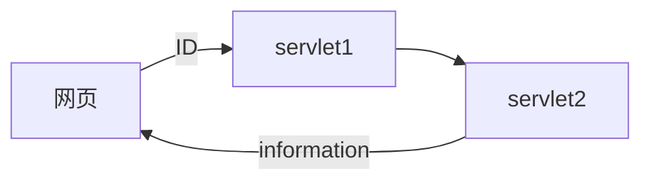

需求分析
__1.__ 目的:实现servlet对象的数据共享
创建两个Servlet，第一个用于存储被访问次数，第二个用于显示前面Servlet被访问的次数。
__2.__ 目的:实现servlet对象的数据转发

__3.__ 目的:实现两个servlet同时运行
```mermaid
graph LR
网页---->servlet1---->网页
网页---->servlet2---->网页
