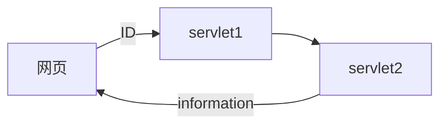
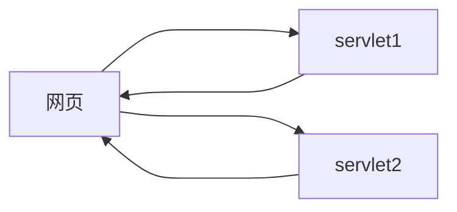
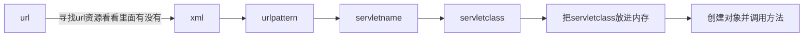

#experiment2
##实现1
###需求分析
目的:实现servlet对象的数据共享
创建两个Servlet，第一个用于存储被访问次数，第二个用于显示前面Servlet被访问的次数。

##实现2
###需求分析
目的:实现servlet对象的数据转发
表单获取id
后台匹配信息
可以使用字典+数组来进行配对
输出到页面

###todo
__把表单中的数据与本地信息比对__
+ 表单里传进来的数据是什么类型的__  //获取为string
+ 使其为string__ //不用
+ 使其成功能与本地信息比对
+ 将单个servlet变成一个用于接受请求并转发 一个用于判断和返回响应

##实现3 
###需求分析
目的:实现两个servlet同时运行

##知识总结:
__tomcatconfigurations中点击deployment后的application context作用__
里面填写的就是你的虚拟路径
如果什么都没有填写 那么路径就是jsp所在的文件夹的路径也就是你可以直接在localhost://8080后直接加/与jsp同路径的文件
如果填写了东西 那么服务器运行时你的url中就是localhost://8080+虚拟路径 然后想访问资源就按照路径来填写
不管虚拟路径中写的是什么，jsp依然会是首页
 

__form中action如何绑定servlet__
form中的action = "\servlet-name"
然后再在xml中注册servlet-name
运行原理:

__从html表单中获取的数据无法判断__
首先，从html中获取的数据是String，然后String比对如果用==就是判断是否同一个对象
我现在只是想要值相同，所以用equals()

__注册WebServlet__
原来的Servlet就要用到web.xml来配置
当Servlet的版本为3.0以上时即可用注解@webServlet来配置
@webServlet(urlPatterns = "/name")
如果只有一个属性的话value可以不写
value等价于 urlPatterns 属性，与该属性不能同时使用
@webServlet(value = "/name")
最终又可以省略
@webServlet("/name")

