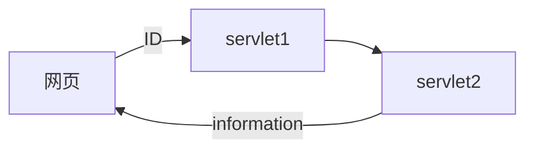
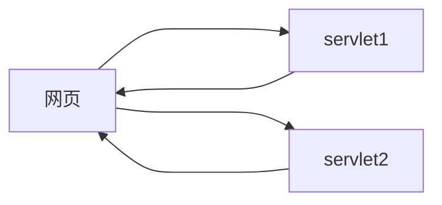
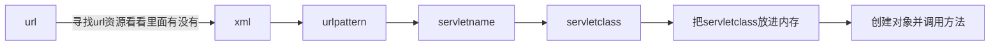

需求分析
__1.__ 目的:实现servlet对象的数据共享
创建两个Servlet，第一个用于存储被访问次数，第二个用于显示前面Servlet被访问的次数。
 
 
__2.__ 目的:实现servlet对象的数据转发
表单获取id
后台匹配信息
可以使用字典+数组来进行配对
输出到页面

 
 
 
 
 

__3__ 目的:实现两个servlet同时运行

 
 
 
 

__知识总结:__
__tomcatconfigurations中点击deployment后的application context作用__
里面填写的就是你的虚拟路径
如果什么都没有填写 那么路径就是jsp所在的文件夹的路径也就是你可以直接在localhost://8080后直接加/与jsp同路径的文件
如果填写了东西 那么服务器运行时你的url中就是localhost://8080+虚拟路径 然后想访问资源就按照路径来填写
不管虚拟路径中写的是什么，jsp依然会是首页
 

__form中action如何绑定servlet__
form中的action = "\servlet-name"
然后再在xml中注册servlet-name
运行原理:

__todo__
把表单中的数据与本地信息比对
1.表单里传进来的数据是什么类型的
2.使其为string
3.使其成功能与本地信息比对

